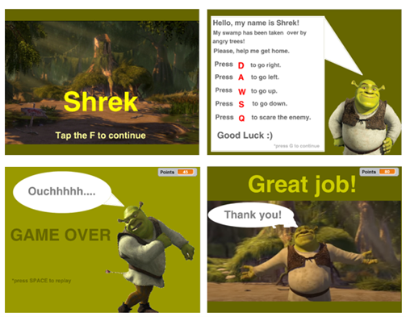
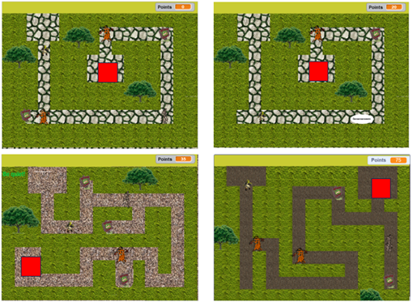
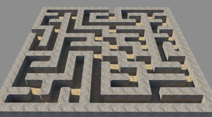
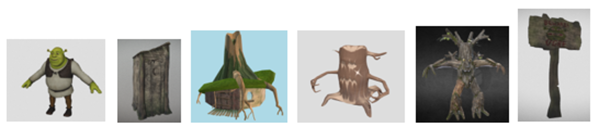

<h1>Shrek’s Swamp Maze</h1>

Passing the labyrinth (maze) with enemy creatures.

<ul>
  <li>Windows</li>
  <li>Landscape orientation</li>
</ul>

<h2>Concept:</h2>

The project is a labyrinth-walker in the style of the animated film "Shrek". 

The main character, an ogre, urgently needs to get to a place of extreme solitude, but he discovers that his native and quiet swamp has been captured by some strange tree-like creatures.

Controlling the main character, you need to get to the desired place, driving away uninvited guests and politely asking (by shouting loudly) them to leave the private territory. But you need to be careful, as they look very unfriendly to constructive dialogue.

Upon reaching the finish line, Shrek passes the maze level and wins, and upon receiving damage (weighty arguments against Shrek's claims) from an uninvited guest, he loses health and loses.

In order to be more convincing when explaining that this is private territory, it is necessary to collect signs saying "Caution! Evil Ogre!" The more signs collected, the better.

<h2>Reference and visual style:</h2>

The reference is our own project on a similar topic, implemented in the visual programming environment Scratch:

<href>https://scratch.mit.edu/projects/933567218</href>

<figure>
   
   <figcaption>Picture 1 - UI of the original Scratch project</figcaption>
  </figure>

<figure>
   
   <figcaption>Picture 2 - Scratch project level design</figcaption>
  </figure>

 

However, the current implementation of the project involves 3D visualization:

<ul>
  <li>3D models of the player, enemies, start and finish, bonuses, and the maze level.</li>
  <li>The camera is static and looks down at the level from above at an angle.</li>
  <li>In order for all locations of enemies and bonuses to be visible, the boundary walls of the labyrinth will be visually lower than the height of the hero and enemies.</li> 
</ul>

<figure>
   
   <figcaption>Picture 3 - Example of camera placement</figcaption>
  </figure>

  

The UI is relatively minimalistic, similar to the original, but with buttons.

The visual style of the levels corresponds to the style of a cartoon: natural landscape, recognizable model of the player and corresponding models of enemies, start and finish. The walls of the labyrinth visually represent vegetation (bushes).

<figure>
   
   <figcaption>Picture 4 - 3D models of the player, start and finish, enemies and bonuses</figcaption>
  </figure>

<h2>Life cycle:</h2>
<ol>
  <li>Launch/start the game by pressing the «START» button in the start menu.</li>
  <li>Screen with plot/backstory, control description and button to go to the maze level.</li>
  <li>Passing the labyrinth from the START point to the FINISH point, avoiding enemy creatures, «scaring» enemy creatures, collecting bonuses in the form of signs.
</li>
  <li>The player loses (runs out of lives) when touching an enemy creature, a screen with a loss and an offer to start the game over by pressing the «RESTART» button is displayed. The transition to point 1 occurs.
</li>
  <li>The player wins when he successfully reaches the «FINISH» point. The «You won» screen is activated, showing the points earned, and also offering to play the game again by pressing the «RESTART» button. The transition to point 1 occurs.
</li>
</ol>

<h2>Mechanics and features:</h2>
<h3><u>Core mechanics:</u></h3>
<ul>
  <li>The player is controlled by pressing the keys W, A, S, D.</li>
  <li>The player «scares» by pressing the Q key.
</li>
  <li>The player moves through the labyrinth without passing through its walls and enemy creatures.
</li>
  <li>A player loses (lives) when touching an enemy creature.
</li>
  <li>When a player approaches, the static enemy turns towards the player and attempts to attack him.
</li>
  <li>A static enemy dies when hit by a «scream».
</li>
  <li>A dynamic enemy patrols part of the labyrinth corridors along a given route.
</li>
  <li>A dynamic enemy dies when hit by a «scream».
</li>
  <li>Pressing the Q key causes the player to emit a «scream» that, when it hits an enemy creature, takes away its life.
</li>
    </ul>

<h3><u>Additional-mechanics:</u></h3>
<ul>
  <li>The player collects bonuses in the form of signs and receives points for this.
</li>
  <li>Upon reaching the finish line, the player is transferred to the next level.

  <li><ul>
    <li>Level 1 – all enemies are static and to pass the level you need to «scare» them.
</li>
    <li>Level 2 (stealth) – all enemies are dynamic and move around the labyrinth, but you cannot attack them, you can only avoid them in other parts of the labyrinth.
</li>
    <li>Level 3 – static and dynamic enemies that can be «scared».
</li>
 </ul>   

  <li>The dynamic enemy does not move along a set path, but between certain points in a random order, independently choosing the shortest path.
</li>
  <li>When the player is at close range, the dynamic enemy begins to pursue him, deviating from its route.
</li>
  <li>When the player is very close to a dynamic enemy, the enemy will begin to attack him.
</li>
  <li>Score points for «scaring» an enemy creature.
</li>
    </ul>

<h3><u>Juice mechanics:</u></h3>
<ul>
  <li>The player cannot complete the level until he collects all the bonuses and/or «scares» all the enemy creatures.
</li>
  <li>Moving/pushing objects in a maze is similar to the game «Sokoban».
</li>
  <li>Adding objects that can be moved around the maze.
</li>
  <li>Adding a new level that features object movement mechanics.
</li>
</ul>

<h2>Build:</h2>

The project build can be downloaded from the following link:

<href>https://drive.google.com/drive/folders/1vqVZ-kQntSPhnt7hrg3ffa7bEabEGP9F?usp=sharing</href>
<h2>Launch instructions:</h2>

1. Download the project build from the link.

2. Unzip the downloaded files if they were downloaded as an archive.

3. Launch ShrekMaze3D.exe.

